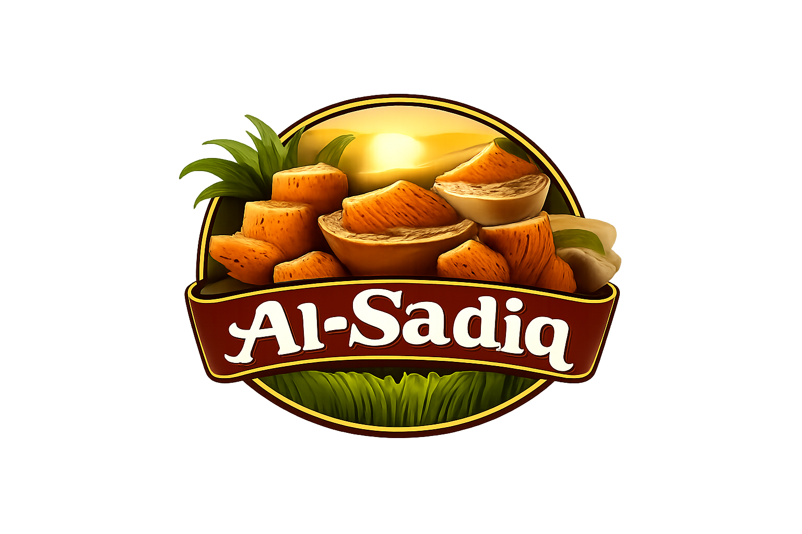

# AlSadiq Qand & Jaggery - Digital Platform for Heritage Sweeteners



A specialized B2B/B2C hybrid web platform for traditional Pakistani sweeteners, connecting artisans with businesses while providing premium heritage products to consumers.

## 🏢 Project Overview

**AlSadiq Qand & Jaggery** is a digital platform that revolutionizes the distribution of traditional Pakistani sweeteners. The project serves as both a B2B wholesale portal for food businesses and a B2C retail showcase for consumers interested in authentic, heritage sweeteners.

### 🎯 Key Features

- **Dual Business Model**: Seamlessly serves both wholesale businesses (B2B) and retail customers (B2C)
- **Product Showcase**: Interactive display of traditional sweeteners including Jaggery, Qand, and Brown Sugar
- **Wholesale Inquiry System**: Professional B2B lead generation with quote request forms
- **Shopping Cart**: Retail shopping experience with cart functionality
- **Responsive Design**: Fully responsive across all devices
- **Modern UI/UX**: Clean, intuitive interface with smooth animations

## 📁 Project Structure

### HTML Files
```
├── index.html          # Main landing page
├── product.html        # Shop Retail page
├── retail.html         # B2B Wholesale page
├── checkout.html       # Shopping cart & checkout
├── individual.html     # Individual product description
├── contact.html        # Contact page
├── aboutus.html        # About Us page
```

### CSS Files
```
├── styles.css          # Main stylesheet (shared components)
├── product.css         # Shop Retail page styles
├── checkout.css        # Cart & checkout styles
├── individual.css      # Individual product page styles
├── aboutstyles.css     # About page styles
├── contacts.css        # Contact page styles
```

### JavaScript Files
```
├── render.js           # Product page rendering & interactions
├── productsData.js     # Product data storage
├── cart.js             # Shopping cart functionality
├── checkout.js         # Checkout page logic
├── productDescription.js # Individual product page logic
├── retail.js           # B2B page functionality
├── about.js            # About page interactions
```

### Assets
```
├── AlSadiq/            # Image assets directory
│   ├── logo.png
│   ├── cart.png
│   ├── gurr2.png
│   ├── shakkar.png
│   ├── qand2.png
│   ├── gurr.jpg
│   └── ...
```

## 🚀 Getting Started

### Prerequisites
- Modern web browser (Chrome, Firefox, Edge)
- Local server setup (Apache2, Live Server, etc.)
- Basic understanding of HTML, CSS, JavaScript

### Installation & Setup

1. **Clone the repository**
   ```bash
   git clone https://github.com/yourusername/alsadiq-heritage-sweeteners.git
   ```

2. **Navigate to project directory**
   ```bash
   cd alsadiq-heritage-sweeteners
   ```

3. **Set up local server**
   - Option A: Using VS Code Live Server extension
   - Option B: Using Dockerised Apache2  server **Recommended**:
     ```bash
     #initiate an Apache2 Docker container with the root directory of project as /var/www/html/  and run:
     docker start <container_name>

     ```

4. **Access the website**
   - Open browser and navigate to `http://localhost:8000`
   - Or your configured local server address

## 🛠️ Technical Implementation

### Core Technologies
- **HTML5**: Semantic markup and structure
- **CSS3**: Modern styling with CSS Grid, Flexbox, and custom properties
- **Vanilla JavaScript**: No frameworks for optimal performance
- **Local Storage**: Persistent cart data storage
- **Responsive Design**: Mobile-first approach

### Key JavaScript Features
- **Dynamic Product Rendering**: Products loaded from centralized data file
- **Shopping Cart System**: Add/remove items with quantity management
- **Form Validation**: Client-side validation for contact and B2B forms
- **Interactive UI**: Smooth animations and user feedback
- **Local Storage Integration**: Persistent cart across sessions

### Design Principles
- **Warm Color Palette**: Earthy tones reflecting natural products
- **Clean Typography**: Readable fonts with proper hierarchy
- **Consistent Spacing**: 8px grid system for visual consistency
- **Accessibility**: Semantic HTML and ARIA labels
- **Performance**: Optimized images and lazy loading

## 📱 Pages Overview

### 1. Home Page (`index.html`)
- Company introduction and value proposition
- Featured products showcase
- Audience split (B2B vs B2C)
- Company story and process visualization

### 2. Shop Retail (`product.html`)
- Interactive product grid with filtering
- Shopping cart integration
- Product details and pricing
- Toast notifications for cart actions

### 3. B2B Wholesale (`retail.html`)
- Professional wholesale inquiry form
- Business partnership information
- Industry-specific pricing
- Account management features

### 4. Product Details (`individual.html`)
- Detailed product information
- Multiple product images
- Usage suggestions and benefits
- Related products recommendations

### 5. Shopping Cart (`checkout.html`)
- Cart item management
- Quantity adjustment
- Order summary
- Checkout process simulation

### 6. Contact & About Pages
- Company contact information
- Team introduction
- Business location and hours
- Contact form with validation

## 🔧 Development Features

### *Dynamic*Product Data Management
- Centralized product data in `productsData.js`
- Easy product additions/modifications
- Consistent data structure across pages

### Cart Functionality
- Persistent cart using localStorage
- Real-time quantity updates
- Cart total calculation
- Cross-page cart synchronization


## 👥 Target Audience

### Primary Users (B2B)
- Food manufacturers and processors
- Restaurant and hospitality businesses
- Retail store chains
- Export companies
- Bulk purchasers

### Secondary Users (B2C)
- Home cooks and bakers
- Health-conscious consumers
- Traditional food enthusiasts
- Gift shoppers

## 🎓 Academic Relevance

This project demonstrates:
- **HTML & CSS Basics for website Design**
- **JavaScript DOM manipulation**
- **Local storage** usage
- **Form validation** techniques
- **User experience** design principles
- **Business logic** implementation

## 📊 Business Model Analysis

### Unique Value Proposition
1. **Bridge traditional artisans with modern markets**
2. **Specialized focus on heritage sweeteners**
3. **Dual revenue streams (B2B wholesale + B2C retail)**
4. **Quality assurance and traceability**
5. **Cultural preservation through traditional products**

### Market Differentiation
- Not a generic e-commerce platform
- Niche focus on specific product category
- Combination of wholesale and retail
- Emphasis on tradition and authenticity

## 👨‍💻 Authors

### Development Team
| Name | Roll Number | Contribution |
|------|------------|--------------|
| **Muhammad Saim Raza** | BCSF25M007 | Project architecture, JavaScript logic, Cart system |
| **Muhammad Hashir Irfan** | BCSF25M042 | UI/UX design, CSS implementation, Responsive layouts |
| **Rana M. Hamza** | BCSF25M015 | Content creation, Product data, Documentation |

### Individual Contributions
- **Muhammad Saim Raza**: Core JavaScript functionality, Cart system, Product rendering logic
- **Muhammad Hashir Irfan**: Visual design, CSS architecture, Responsive implementation
- **Rana M. Hamza**: Content strategy, Product descriptions, Project documentation

## 🔄 Project Status

**Current Version**: 1.0.0  
**Last Updated**: December 2025  
**Status**: Completed for academic submission

### Features Completed
- ✅ Complete website with all planned pages
- ✅ Responsive design across all devices
- ✅ Functional shopping cart system
- ✅ B2B inquiry form
- ✅ Product filtering and sorting
- ✅ Local storage integration
- ✅ Form validation
- ✅ Interactive UI elements

## 📝 License

This project was developed for academic purposes as part of the university coursework. All code and design are original work created for educational demonstration.

## 🙏 Acknowledgments

- Faculty guidance and support
- Deepseek, for Grunt work
- Open-source community for inspiration and resources
- Team collaboration and peer learning

## 📞 Contact

For queries regarding this project:
- **Course**: Web Technologies/ICT Project
- **University**: [Your University Name]
- **Semester**: Fall 2024
- **Instructor**: [Instructor Name]

---

*This project represents the culmination of web development skills learned during the semester, implementing real-world business concepts in a digital platform for traditional sweeteners.*
